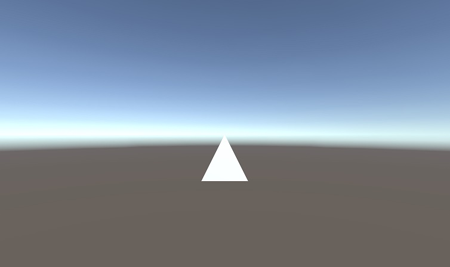

# SimpleMeshReader-Unity
The reading of the mesh file(off file) in Unity.
This script can read mesh file (off file) with no comment and triangle element.

## Version of Unity
5.6.1f1

## Screen Shot
